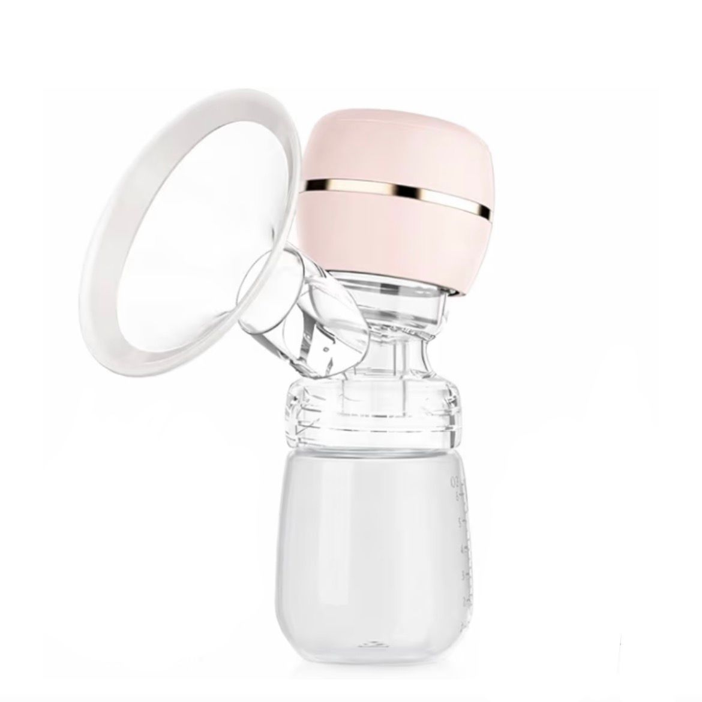

# Mumma First — Homepage

> *Because every mother deserves comfort and care*

A premium, brand-first homepage for **Mumma First** — a motherhood support brand. Built with pure HTML, CSS, and minimal vanilla JavaScript. No frameworks. No dependencies beyond Google Fonts.

---

## Preview

| Section | Layout |
|---|---|
| Hero | Split (50% text / 50% image) |
| Story | Left image + Right text |
| Problem | Left text + Right image |
| Philosophy | 4-column grid |
| Solutions | 2-column grid |
| Product | Asymmetric split (5/7) |
| FAQ | 2-column list |
| Final CTA | Centered, full-width |

---

## Project Structure

```
mumma-first/
├── index.html       # Main homepage
├── styles.css       # All styles and design tokens
├── main.js          # Scroll animations, sticky nav
├── README.md        # This file
├── hero.jpg         # Hero section image (uploaded directly to root)
├── story.jpg        # Brand story + problem section image
└── product.jpg      # Featured product image
```

> **Note:** Images are placed directly in the root of the repository — not inside a subfolder.
> GitHub does not support folder uploads via the web interface, so all `.jpg` files
> sit alongside `index.html` at the top level.

---

## Getting Started

### 1. Clone or download

```bash
git clone https://github.com/your-username/mumma-first.git
cd mumma-first
```

### 2. Add your images

Upload your images **directly into the root of the repository** — the same level as `index.html`. The filenames must match exactly:

| File | Recommended dimensions | Notes |
|---|---|---|
| `hero.jpg` | 1200 × 1600px | Warm, lifestyle — mother/baby |
| `story.jpg` | 900 × 1200px | Soft, candid, natural light |
| `product.jpg` | 800 × 1000px | Clean/white background |

### 3. Confirm image paths in `index.html`

Because images are at the root level, all `src` paths must reference them directly without any folder prefix:

```html
<!-- Correct — root-level path -->




<!-- Wrong — do NOT use a subfolder path -->

```

### 4. Open in browser

```bash
open index.html
# or just double-click index.html
```

No build step. No server required.

---

## Design System

### Colors

| Token | Hex | Usage |
|---|---|---|
| `--bg-cream` | `#FDFBF9` | Primary background |
| `--bg-warm` | `#FAF3E8` | Alternate section background |
| `--text-dark` | `#5A3A2E` | Headings, primary text |
| `--text-mid` | `#8A6358` | Body text, captions |
| `--accent-light` | `#EBCBCB` | Emotional block background, decorative |
| `--accent-mid` | `#D8A7A7` | Borders, underlines, ornaments |
| `--accent-deep` | `#C08080` | Tags, eyebrows, arrows |

### Typography

| Role | Font | Size | Weight |
|---|---|---|---|
| Headings | Playfair Display | 30px – 68px | 400 (Regular) |
| Italic accent | Playfair Display | — | Italic |
| Body | DM Sans | 16px – 18px | 300 – 400 |
| Tags / Eyebrows | DM Sans | 11px – 13px | 500, uppercase |

Fonts are loaded from Google Fonts — requires an internet connection on first load.

### Spacing

| Token | Value |
|---|---|
| `--gap-xl` | `120px` (between major sections) |
| `--gap-lg` | `80px` |

---

## Sections

1. **Hero** — Split layout with brand name, tagline, and supporting line
2. **Transition Statement** — Full-width centered italic quote
3. **Story** — Left image + right text explaining brand origin
4. **Problem** — Right image + left text addressing emotional reality
5. **Brand Response** — Centered statement of purpose
6. **Philosophy** — 4-column grid: Simplicity, Care, Trust, Mother-first
7. **Experience** — Full-width warm gradient background with overlay text
8. **Solutions** — 2x2 grid of product categories (no products, categories only)
9. **Product** — Asymmetric split with featured product and explore link
10. **Testimonial** — Large centered quote
11. **Emotional Block** — "You are not alone" with soft blush background
12. **FAQ** — 2-column list, 4 questions on safety, comfort, portability, returns
13. **Final CTA** — Centered minimal call-to-action with watermark monogram

---

## Customisation

### Changing brand copy

All text is inline in `index.html`. Search for the section comment (e.g. `<!-- 3. STORY -->`) and edit the content directly.

### Changing colors

All colors are defined as CSS variables at the top of `styles.css`:

```css
:root {
  --bg-cream: #FDFBF9;
  --text-dark: #5A3A2E;
  /* ... */
}
```

Change any value there and it updates across the entire page.

### Changing fonts

Replace the Google Fonts `<link>` in `<head>` and update the CSS variables in `styles.css`:

```css
--serif: 'Your Serif Font', Georgia, serif;
--sans:  'Your Sans Font', sans-serif;
```

### Adding real navigation links

Update the `<nav>` section anchor hrefs in `index.html` to match your actual page sections or routes.

---

## Animations

Scroll-triggered **fade-in + slide-up** on all major elements, powered by the native `IntersectionObserver` API — no libraries.

- `.reveal` — base animation class
- `.reveal-delay-1` / `-2` / `-3` — staggered delays (0.15s, 0.30s, 0.45s)
- Hero elements trigger immediately on load (100ms timeout)
- Nav gains `.scrolled` class (frosted glass effect) after 60px scroll

---

## Browser Support

| Browser | Support |
|---|---|
| Chrome 88+ | Full |
| Firefox 85+ | Full |
| Safari 14+ | Full |
| Edge 88+ | Full |
| IE 11 | Not supported |

Uses `IntersectionObserver`, CSS custom properties, CSS Grid, and `backdrop-filter` — all widely supported in modern browsers.

---

## Responsive Breakpoints

| Breakpoint | Layout changes |
|---|---|
| 900px and below | All split grids collapse to single column; hero image becomes banner |
| 540px and below | Philosophy grid collapses to single column |

---

## Deployment on GitHub Pages

Because images are uploaded directly to the repository root, deployment is straightforward:

1. Push all files to your GitHub repository:
   `index.html`, `styles.css`, `main.js`, `hero.jpg`, `story.jpg`, `product.jpg`
2. Go to **Settings → Pages** in your repository
3. Under **Source**, select the `main` branch and set the folder to **root**
4. Click **Save** — your site will be live at `https://your-username.github.io/mumma-first`

### Other hosting options

- **Netlify** — drag and drop the folder at app.netlify.com
- **Vercel** — `vercel deploy` from the project folder
- **Any static host** — upload all files to the same root directory

---

## License

This code is provided for use with the Mumma First brand. Please replace placeholder images and copy before publishing.

---

*Designed with intention. Built for mothers.*
